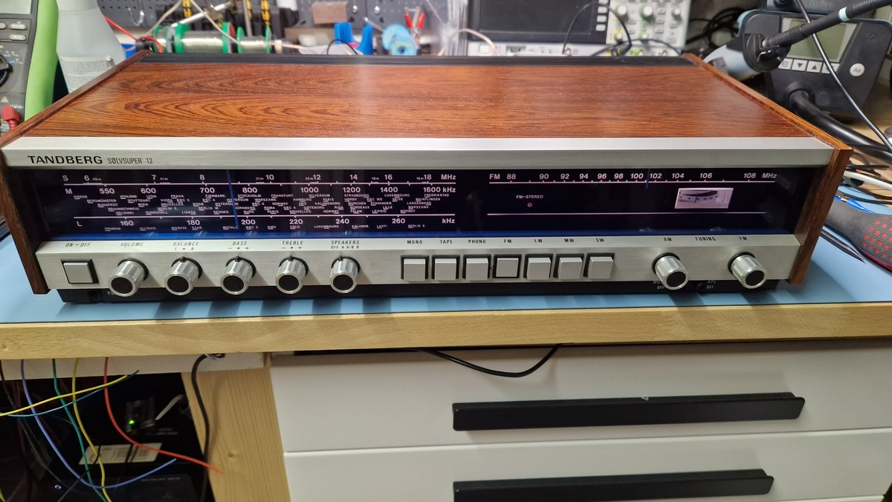
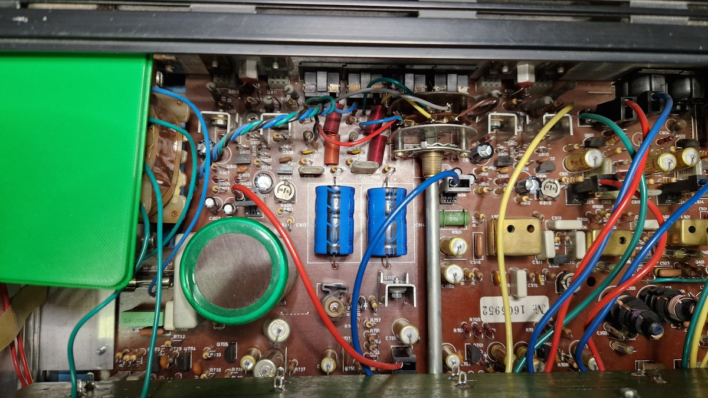
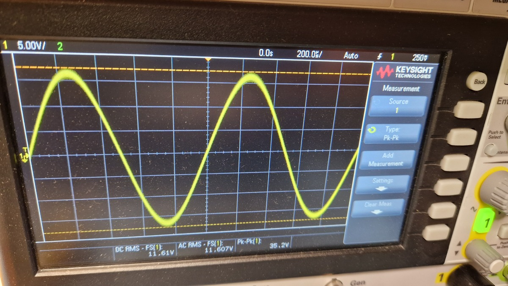
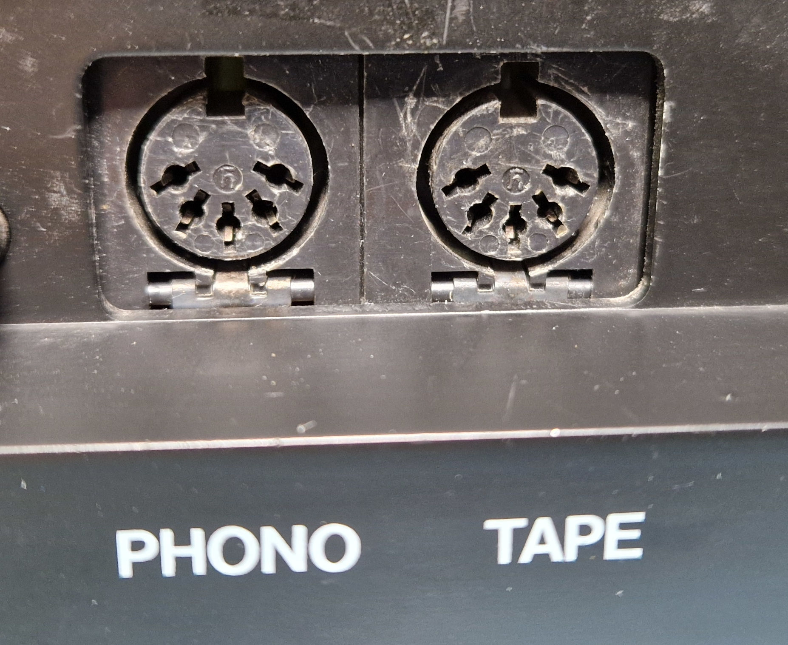

# Repair notes for Tandberg Sølvsuper 12

- Date: May/June 2023
- Model: SS 12 (Tandberg Sølvsuper 12)
- Serial number: label removed, number on main PCB: 1605952

## Symptoms

Speaker selector making noise, weak audio on left channel.

## Short about Tandberg Sølvsuper S12

Produced by Tandberg Radiofabrikker A/S Oslo in Norway around 1976-77. Radio receiver (FM stereo, AM) and amplifier with inputs for phono and tape. RIAA pre-amplifier with support for both magnetic and ceramic pickup. Service manual with schematic can be found on Tandberg Facebook groups.

## Modifications and fixes

Resoldered the connection for the speaker selector and the other ports. Also soldered other connections that looked weak. The solder for the soft start bulb (12V, 3W) was very soft and was resoldered. This resoldering pretty much fixed the unstable speaker selector.

Changed all the 6 lamps (6.3v) for the scale indicator and resoldered the connection to the transformer. Changed one of the holders as it was crumbling. Measured 12V AC to the PCB that holds the lamps.

Changed capacitors for left and right channel in the output stage of the amplifier. Might not have been necessary to change all of them.

<table>
    <thead>
        <tr>
            <th>Reference designator</th>
            <th>New value</th>
            <th>New brand</th>
            <th>Capacitance of replaced component<th>
            <th>ESR of replaced component</th>
        </tr>
    </thead>
    <tbody>
        <tr>
            <td>C801/C802</td><td>2.2uF 100V</td><td>Panasonic</td><td>2uF</td><td>>40</td>
        </tr>
        <tr>
            <td>C803/C804</td><td>22uF 63V</td><td>Panasonic</td><td>25uF</td><td>0.9</td>
        </tr>
        <tr>
            <td>C807/C808/C809/C810</td><td>47uF 63V</td><td>KEMET</td><td>25-44uF</td><td>11-32.8</td>
        </tr>
        <tr>
            <td>C813/C814</td><td>2200uF 40V</td><td>Vishay</td><td>2180uF/2193uF</td><td>0, 2.3</td>
        </tr>
    </tbody>
</table>

Measured the oscillator of U901 (CA1310E FM Multiplex Stereo Decoder) at test point M901 with frequency counter to 22 kHz and tried to adjust R911 to the expected 19 kHz, but could not adjust it down. Ended up replacing trimpot R911 and U901 and adjusted it to 19 kHz. 

The cord (skalasnor) used for the AM adjustment was only moving in one direction. It was remounted according the instructions in the services manual. Also applied some resin to the cord to make it a bit more sticky to improve friction against the tuning wheels. But what really helped was to use some fine valve oil on the shaft of the variable capacitor for AM.

## Cleaning

General cleaning of dust and debris with compressed air and isopropanol. Used CRC electronic cleaner to clean the buttons (Petrick) and the pots used for volume, balance, bass, treble. Polished the rosewood with bee wax. Cleaned off the blue transparent plastic that is front of the scale.

## Measurements

Measure the output power for each channel with a 8 ohm dummy load and measured the Vrms with an oscilloscope. AC RMS showed around 11.6V for each channel. P = U^2/R = 134.56 / 8 = 16.82W which corresponds with the expected 15W at 8 ohm. No DC offset found on the speaker outputs.

Used an RF generator (TinySA Ultra) to confirm that the scale for FM and AM are approx aligned. Didn't have time/competence to do full alignment of AM and FM.

## Checklist

- Check speaker selector A and B and headset connector
- Check turntable connected to phono
- Check tape input
- Verify balance, bass and treble
- Tune a FM radio station

## Conclusion

Fun project and in overall a good learning experience. Works better than before although the radio section is not aligned.

# Update 8. February 2025

Resoldered the pins for the Phono connector at the rear. Probably caused by too much mechanical stress on the solder joint. Testing revealed that also the Tape connector was having problems with the right channel. Worked fine after resoldering.

The problem will mostly reappear as the ports are really wiggly. One option could be to replace the DIN jack with RCA panel mount jacks, but that is for later.
